# Family Tree Graph - Implementation Plan

## Overview
Build an interactive family tree visualization using React Flow and Dagre.js with editable JSON data storage.

---

## UI Architecture

### Main Layout (using ReactFlow Panels)


**Panel Positions:**
- `top-left`: Direction toggle (TB/BT/LR/RL)
- `top-right`: Sidebar panel for editing selected person
- `bottom-left`: Zoom controls, fit view button

### Node Types

```mermaid
graph TB
    subgraph PersonNode["Single Person Node"]
        direction TB
        I1["👤 Icon"]
        N1["Name"]
        D1["Birth - Death"]
    end

    subgraph CoupleNode["Couple Node (Merged)"]
        direction TB
        subgraph Icons
            I2["👤"]
            I3["👤"]
        end
        N2["Name 1 & Name 2"]
        D2["Dates"]
    end
```



### Component Hierarchy


### Data Flow


---

## Data Structure

### TypeScript Types

```typescript
interface Person {
  id: string;
  name: string;
  birthDate?: string;
  deathDate?: string;
  gender: 'male' | 'female' | 'other';
  spouseId?: string;
  parentIds: string[];  // IDs of parent couple or single parent
}

interface FamilyData {
  members: Person[];
  settings: {
    direction: 'TB' | 'BT' | 'LR' | 'RL';
  };
}
```

### Sample JSON (`src/data/family.json`)

```json
{
  "members": [
    {
      "id": "gp1",
      "name": "Grandfather",
      "birthDate": "1940",
      "deathDate": "2010",
      "gender": "male",
      "spouseId": "gm1",
      "parentIds": []
    },
    {
      "id": "gm1",
      "name": "Grandmother",
      "birthDate": "1945",
      "gender": "female",
      "spouseId": "gp1",
      "parentIds": []
    },
    {
      "id": "p1",
      "name": "Father",
      "birthDate": "1970",
      "gender": "male",
      "spouseId": "m1",
      "parentIds": ["gp1", "gm1"]
    }
  ],
  "settings": {
    "direction": "TB"
  }
}
```

---

## File Structure (FSD Architecture)

```
src/
├── app/                              # App initialization
│   ├── providers/
│   │   └── family-provider.tsx       # Family data context
│   └── index.tsx
│
├── pages/                            # Page components
│   └── family-tree-page/
│       └── index.tsx
│
├── widgets/                          # Complex UI blocks
│   └── family-tree-graph/
│       ├── ui/
│       │   └── family-tree-graph.tsx # Main ReactFlow container
│       ├── lib/
│       │   └── dagre-layout.ts       # Graph layout utility
│       └── index.ts
│
├── features/                         # User interactions
│   ├── edit-person/
│   │   ├── ui/
│   │   │   └── sidebar-panel.tsx     # Edit sidebar
│   │   └── index.ts
│   ├── add-family-member/
│   │   ├── ui/
│   │   └── index.ts
│   └── layout-controls/
│       ├── ui/
│       │   ├── direction-toggle.tsx
│       │   └── zoom-controls.tsx
│       └── index.ts
│
├── entities/                         # Business entities
│   ├── person/
│   │   ├── ui/
│   │   │   ├── person-node.tsx       # Single person node
│   │   │   └── couple-node.tsx       # Merged couple node
│   │   ├── model/
│   │   │   └── types.ts              # Person types
│   │   └── index.ts
│   └── family/
│       ├── model/
│       │   ├── types.ts              # FamilyData types
│       │   └── use-family-data.ts    # Data management hook
│       └── index.ts
│
├── shared/                           # Reusable utilities
│   ├── ui/                           # Generic components (existing)
│   ├── lib/
│   │   └── format-date.ts            # Date formatting helper
│   └── config/
│       └── graph-config.ts           # ReactFlow defaults
│
└── data/
    └── family.json                   # Static family data
```

See [dev-rules.md](./dev-rules.md) for FSD layer rules and DRY principles.

---

## Implementation Steps

### Phase 1: Setup & Foundation
- [ ] Install dependencies: `reactflow`, `dagre`, `@types/dagre`
- [ ] Create TypeScript types (`src/types/family.ts`)
- [ ] Create sample family data (`src/data/family.json`)
- [ ] Create Dagre layout utility (`src/lib/dagre-layout.ts`)

### Phase 2: Core Components
- [ ] Create `useFamilyTree` hook for data management
- [ ] Build `PersonNode` component with icon, name, dates
- [ ] Build `CoupleNode` component (merged spouse display)
- [ ] Create main `FamilyTree` container with ReactFlow

### Phase 3: Layout & Controls
- [ ] Integrate Dagre auto-layout with ReactFlow
- [ ] Add direction toggle (TB/BT/LR/RL)
- [ ] Add zoom controls and fit-to-view button

### Phase 4: Editing Features
- [ ] Build `SidebarPanel` for viewing/editing details
- [ ] Add click-to-select node functionality
- [ ] Implement add person (child/parent/spouse)
- [ ] Implement delete person with confirmation
- [ ] Auto-save changes to state (localStorage backup)

### Phase 5: Polish
- [ ] Export/Import JSON functionality
- [ ] Styling and theming
- [ ] Edge styling (parent-child connections)

---

## Packages

```bash
npm install reactflow dagre
npm install -D @types/dagre
```

---

## Verification

1. **Visual Check**: Graph renders with correct layout direction
2. **Node Display**: Person shows icon, name, dates
3. **Couple Merge**: Spouses appear as single merged node
4. **Edit Flow**: Click node → sidebar shows details → edit saves
5. **Layout Switch**: TB/BT/LR/RL buttons change orientation
6. **Data Persistence**: Changes persist on refresh (localStorage)
